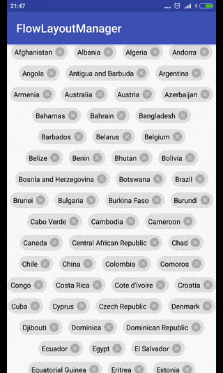

# FlowLayoutManager

Flow layout manager for RecyclerView.Supports **API 10(Android 2.3)** and above.

## Features

1. Vertical/Horizontal orientation;
2. Custom gravity;
3. Maximum items in line;
4. Spaces between items and/or lines;
5. Stores position during orientation changes;
6. Scroll/Smooth scroll.

## Usage

Instead standard layout manager use FLMFlowLayoutManager:

    ...
        
    FLMFlowLayoutManager layoutManager = new FLMFlowLayoutManager(FLMFlowLayoutManager.VERTICAL);
        
    RecyclerView recyclerView = (RecyclerView) findViewById(R.id.recyclerView);
    recyclerView.setLayoutManager(layoutManager);
    recyclerView.setAdapter(new Adapter(this));
        
    ...

To change gravity of the layout manager:
    
    ...
        
    layoutManager.setGravity(Gravity.START|Gravity.CENTER_HORIZONTAL);
        
    ...

To change maximum items count in line:

    ...

    layoutManager.setMaxItemsInLine(4);

    ...

To change spaces between items and lines:

    ...

    layoutManager.setSpacingBetweenItems(10);
    layoutManager.setSpacingBetweenLines(10);

    ...

## License

Copyright 2018 Astrocode011235813

   Licensed under the Apache License, Version 2.0 (the "License");  
   you may not use this file except in compliance with the License.  
   You may obtain a copy of the License at

       http://www.apache.org/licenses/LICENSE-2.0

   Unless required by applicable law or agreed to in writing, software  
   distributed under the License is distributed on an "AS IS" BASIS,  
   WITHOUT WARRANTIES OR CONDITIONS OF ANY KIND, either express or implied.  
   See the License for the specific language governing permissions and  
   limitations under the License.